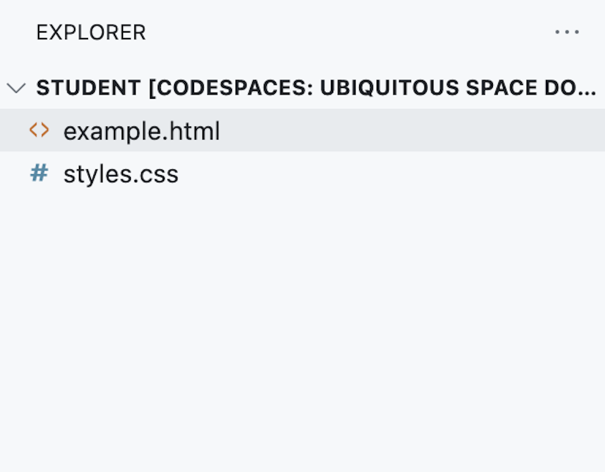

## Document Setup

Locate the documents and files you’ll need to successfully complete the assignment. These files are located in the “Explorer” panel of your Codespace.

Select _example.html_ from the Explorer panel. It will open as a new tab in the Companion tab. Toggle back and forth between the two tabs as you work.
