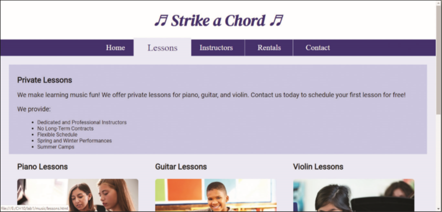

You work for a local music lesson company called Strike a Chord that provides music lessons for piano, guitar, and violin. The company needs a web presence and has hired you to create their website. You have already created the website and now need to add a hamburger menu for a mobile viewport and a transform to create interactivity to the website. _Figure 10-75_ shows the Lessons page in a mobile viewport. _Figure 10-76_ shows the Lessons page in a desktop viewport.

Figure 10-75

Figure 10-76

Use the button below to copy the files from the previous chapter

<!--
{
    "CopyExercise": {
        "name": "Chapter 9 EX01",
        "copyTarget": "/chapter9/ex01/student/*",
        "pasteTarget": "./"
    }
}
-->