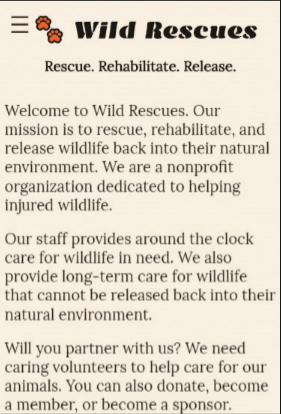
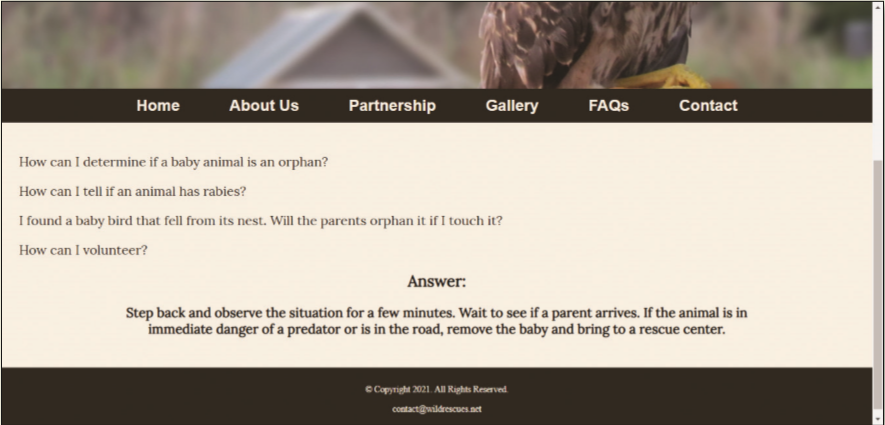

You volunteer at a local wildlife rescue, a nonprofit organization called Wild Rescues. The organization rescues all kinds of wild animals, rehabilitates them, and then releases them back into the wild. Wild Rescues needs a website to help raise awareness about the organization. You have already created the website and now need to add a hamburger menu for a mobile viewport and create other functions to add interactivity to the website. _Figure 10-77_ shows the home page in a mobile (375px) viewport. _Figure 10-78_ shows the FAQs page in a desktop viewport.

Figure 10-77

Figure 10-78

Use the button below to copy the files from the previous chapter

<!--
{
    "CopyExercise": {
        "name": "Chapter 9 EX02",
        "copyTarget": "/chapter9/ex02/student/*",
        "pasteTarget": "./"
    }
}
-->