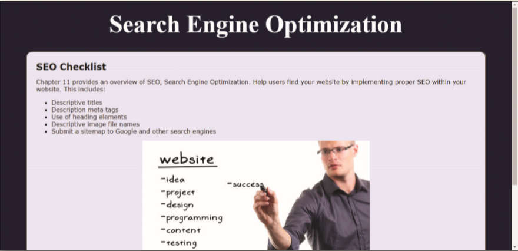

The _index.html_ webpage needs a page `title`, a `meta` description, and `heading` elements. The image file name and `alt` text on the page also need to be improved. Use _Figure 11-62_ as a guide to correct these files.

Figure 11-62
