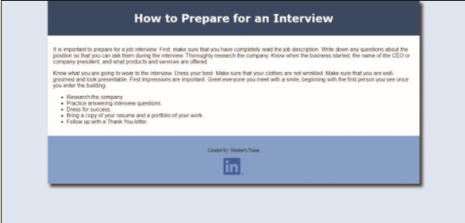

In this exercise, you will create a webpage, add a description `meta` tag to the webpage and then publish the webpage. Work with the _styles.css_ file in the _/css_ folder. The completed webpage is shown in _Figure 11-61_. You will also use professional web development practices to indent, space, comment, and validate your code.

Figure 11-61
