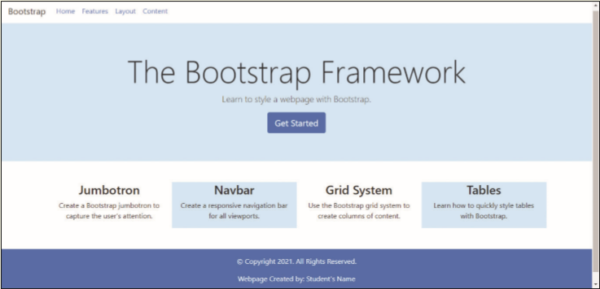

The _index.html_ webpage needs to link to the Bootstrap CDN and then needs Bootstrap classes added to elements. First, link the HTML file to the Bootstrap CDN. Next, add Bootstrap classes to HTML page elements. Then, create an external style sheet and assign your custom style rule to HTML elements. The completed webpage is shown in _Figure 12-67_. You will also use professional web development practices to indent, space, comment, and validate your code.

Figure 12-67
