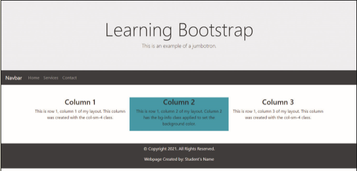

In this exercise, you will create a webpage using the Bootstrap framework. You will use the Bootstrap starter template and then update it with HTML elements and Bootstrap classes to style the page. First, you copy the Bootstrap starter template. Next, you copy the starter template to a new document in your text editor and save it as an HTML file. Then, you update the webpage and add HTML elements, content, and Bootstrap classes to style the page. The completed webpage is shown in _Figure 12-65_. You will also use professional web development practices to indent, space, comment, and validate your code.

Figure 12-65

Open the *index.html* in your browser. View the webpage in desktop, tablet, and mobile viewports.
Validate your HTML document and fix any errors that are identified.

> In this exercise, you created a navbar using the Bootstrap framework. Research how you can use the Bootstrap framework to incorporate a drop-down menu within the navbar.
