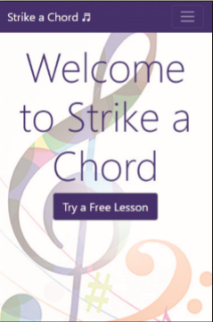
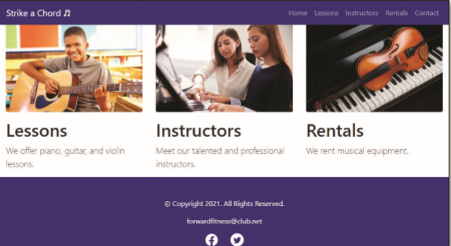
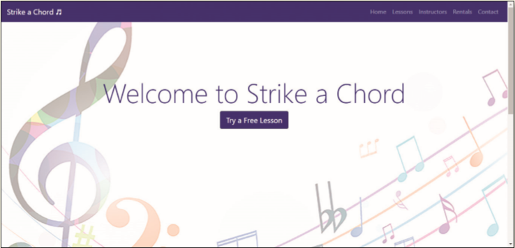

You work for a local music lesson company called Strike a Chord that provides music lessons for piano, guitar, and violin. The company needs a web presence and has hired you to create their website. You have already created a responsive website and are now considering using the Bootstrap framework. Create a new home page using the Bootstrap framework. _Figure 12-68_ shows the home page in a mobile viewport. _Figure 12-69_ shows the home page in a tablet viewport. _Figure 12-70_ shows the home page in a desktop viewport.

Figure 12-68

Figure 12-69

Figure 12-70

Use the button below to copy the files from the previous chapter

<!--
{
    "CopyExercise": {
        "name": "Chapter 11 EX01",
        "copyTarget": "/chapter11/ex01/student/*",
        "pasteTarget": "./"
    }
}
-->