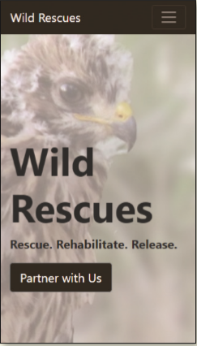
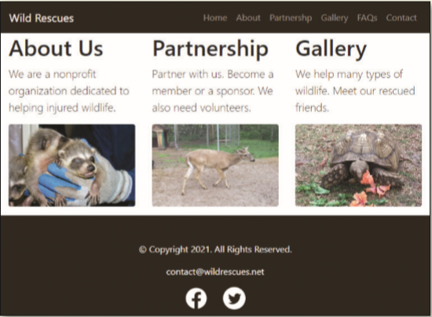
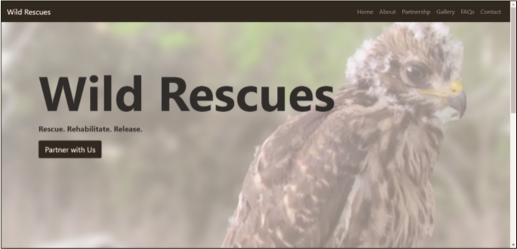

You volunteer at a local wildlife rescue, a nonprofit organization called Wild Rescues. The organization rescues all kinds of wild animals, rehabilitates them, and then releases them back into the wild. Wild Rescues needs a website to help raise awareness about the organization. You have already created a responsive website and are now considering using the Bootstrap framework. Create a new home page using the Bootstrap framework. _Figure 12-71_ shows the home page in a mobile viewport. _Figure 12-72_ shows the home page in a tablet viewport. _Figure 12-73_ shows the home page in a desktop viewport.

Figure 12-71

Figure 12-72

Figure 12-73

Use the button below to copy the files from the previous chapter

<!--
{
    "CopyExercise": {
        "name": "Chapter 11 EX02",
        "copyTarget": "/chapter11/ex02/student/*",
        "pasteTarget": "./"
    }
}
-->