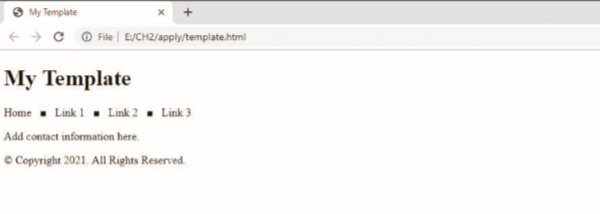

Providing quick access to validated templates is a good practice. In this exercise, you will add all necessary, basic HTML elements to the page. Next, you add comments and static content to the page. Finally, you validate the page and correct any errors. An example of the completed webpage is shown in _Figure 2-33_.

Figure 2-33
