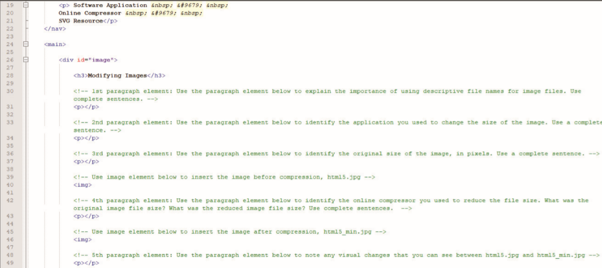

<!--manual-->
In this exercise, you will examine an image file, change the size of an image, compress an image file, add an image to a website, and then use SVG to create a graphic. You will answer several questions as you complete these tasks. The webpage includes several empty elements and comments that contains questions. You will use the empty elements to answer the questions shown in _Figure 3-77_.

Figure 3-77
