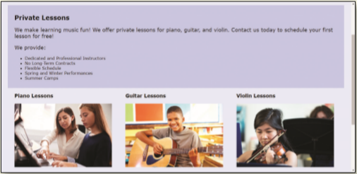
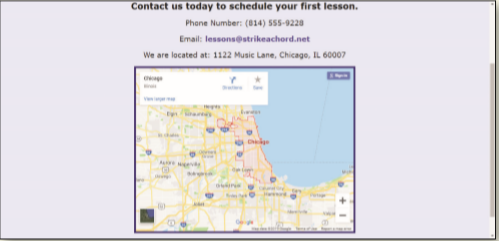

You work for a local music lesson company called Strike a Chord that provides music lessons for piano, guitar, and violin. The company needs a web presence and has hired you to create their website. You have already created the website plan and started creating the HTML pages in _Chapter 1_ through _3_. You now need to create a style sheet to format the website. The Home, Lessons, and Contact webpages are shown in _Figure 4-81a_, _Figure 4-81b_, _Figure 4-81c_.

Figure 4-81a

Figure 4-81b

Figure 4-81c

Use the button below to copy the files from the previous chapter

<!--
{
    "CopyExercise": {
        "name": "Chapter 3 EX01",
        "copyTarget": "/chapter3/ex01/student/*",
        "pasteTarget": "./"
    }
}
-->