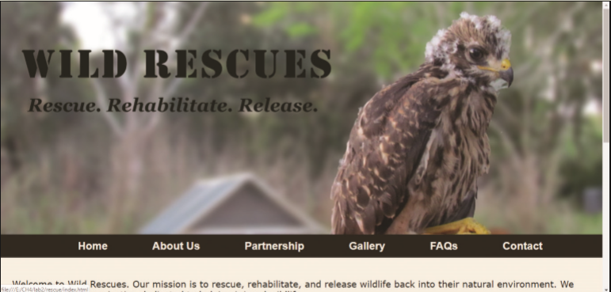
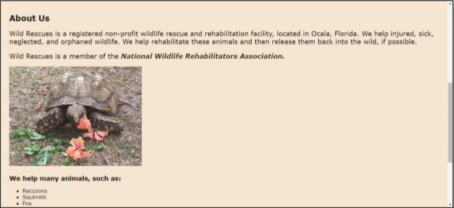
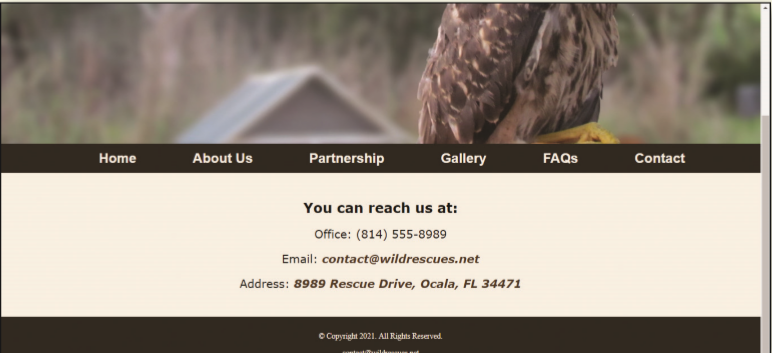

You volunteer at a local wildlife rescue, a nonprofit organization called Wild Rescues. The organization rescues all kinds of wild animals, rehabilitates them, and then releases them back into the wild. Wild Rescues needs a website to help raise awareness about the organization. You have already created the website plan and started creating the HTML pages in _Chapter 1_ through _Chapter 3_. You now need to create a style sheet to format the website. The Home, About Us, and Contact webpages are shown in _Figure 4-82a_, _Figure 4-82b_, and _Figure 4-82c_.

Figure 4-82a

Figure 4-82b

Figure 4-82c

Use the button below to copy the files from the previous chapter

<!--
{
    "CopyExercise": {
        "name": "Chapter 3 EX02",
        "copyTarget": "/chapter3/ex02/student/*",
        "pasteTarget": "./"
    }
}
-->