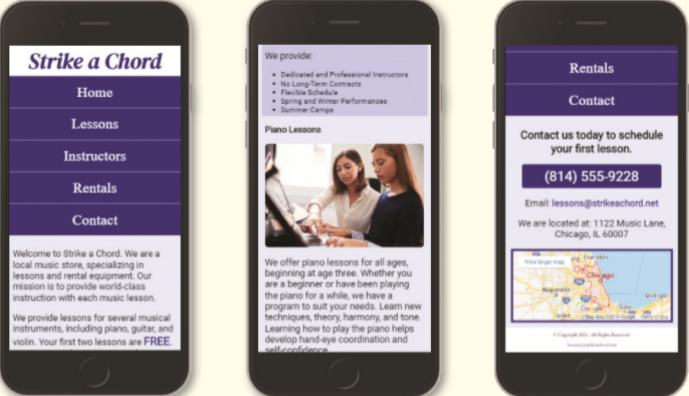

You work for a local music lesson company called Strike a Chord that provides music lessons for piano, guitar, and violin. The company needs a web presence and has hired you to create their website. You have already created several pages for the website and made a style sheet, but now you need to design the website for a mobile viewport. The Home, Lessons, and Contact webpages are shown in **Figure 5-68**.

Figure 5-68

Use the button below to copy the files from the previous chapter

<!--
{
    "CopyExercise": {
        "name": "Chapter 4 EX01",
        "copyTarget": "/chapter4/ex01/student/*",
        "pasteTarget": "./"
    }
}
-->