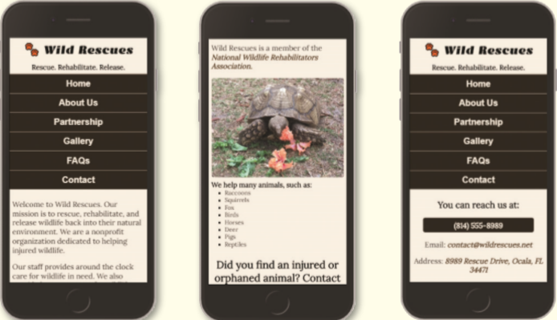

You volunteer at a local wildlife rescue, a nonprofit organization called Wild Rescues. The organization rescues all kinds of wild animals, rehabilitates them, and then releases them back into the wild. Wild Rescues needs a website to help raise awareness about the organization. You have already created several pages for the website and made a style sheet, but now you need to design the website for a mobile viewport. The Home, About Us, and Contact webpages are shown in _Figure 5-69_.

Figure 5-69

Use the button below to copy the files from the previous chapter

<!--
{
    "CopyExercise": {
        "name": "Chapter 4 EX02",
        "copyTarget": "/chapter4/ex02/student/*",
        "pasteTarget": "./"
    }
}
-->