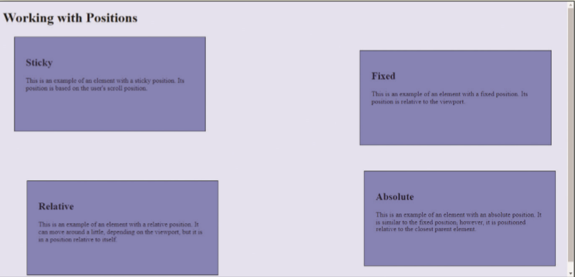

In this exercise, you will create and modify style rules to learn more about how to place elements on a page using positions. An example of page element positions is shown in _Figure 5-66_.

Figure 5-66
