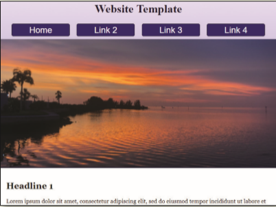
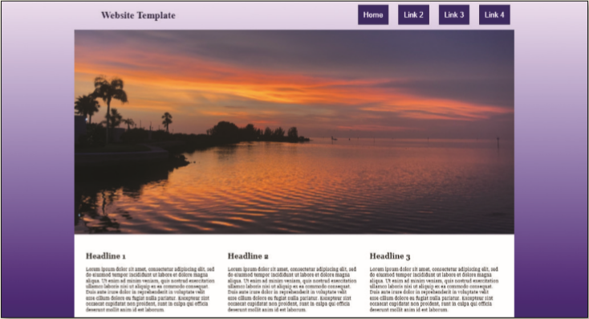

The _index.html_ webpage is a draft website template, but must be corrected and improved for responsive design before presenting it to a client. Use _Figure 6-63_, _Figure 6-64_, and _Figure 6-65_ as a guide to correct these files.

Figure 6-63

Figure 6-64

Figure 6-65
