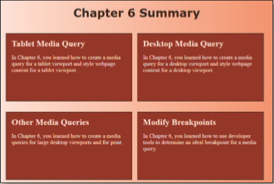
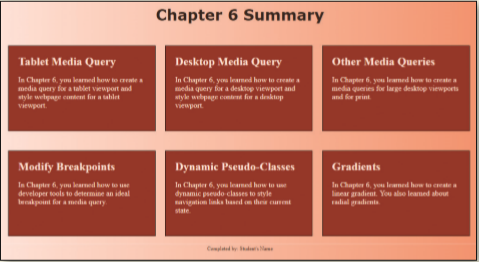

In this exercise, you will add tablet and desktop media queries to a style sheet. You will create style rules for a tablet viewport and a desktop viewport. You then add a style rule for an `article` element to display the content in two columns for a tablet viewport and three columns for a desktop viewport. You will also apply a linear gradient to the page and use a `hover` `pseudo-class`. The completed webpage is shown in _Figure 6-60_ for a tablet viewport and _Figure 6-61_ for a desktop viewport. You will also use professional web development practices to indent, space, comment, and validate your code.

Figure 6-60

Figure 6-61
