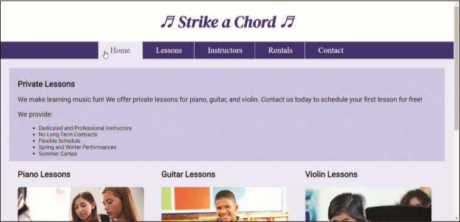

You work for a local music lesson company called Strike a Chord that provides music lessons for piano, guitar, and violin. The company needs a web presence and has hired you to create their website. You have already created the mobile layout, but now need to add media queries for tablet, desktop, and print layouts. _Figure 6-66_ shows the home page in the tablet viewport and _Figure 6-67_ shows the Lessons page in the desktop viewport.

Figure 6-66

Figure 6-67

Use the button below to copy the files from the previous chapter

<!--
{
    "CopyExercise": {
        "name": "Chapter 5 EX01",
        "copyTarget": "/chapter5/ex01/student/*",
        "pasteTarget": "./"
    }
}
-->