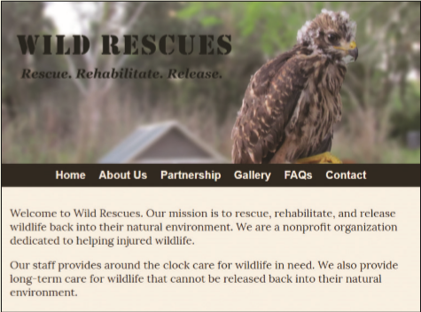
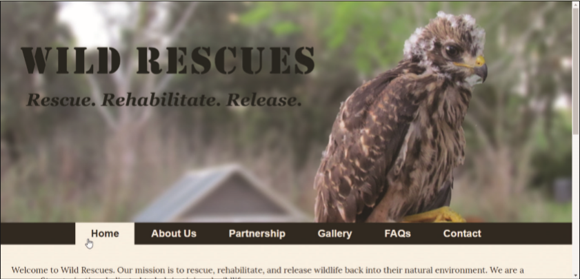
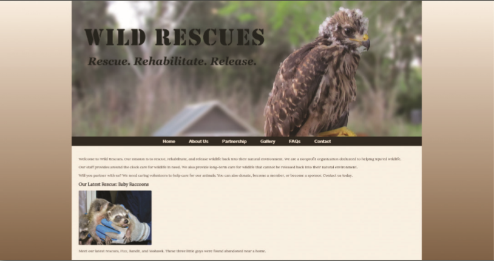

You volunteer at a local wildlife rescue, a nonprofit organization called Wild Rescues. The organization rescues all kinds of wild animals, rehabilitates them, and then releases them back into the wild. Wild Rescues needs a website to help raise awareness about the organization. You have already created the mobile layout, but now need to add media queries for a tablet, desktop, and print. Style the website shown in _Figure 6-68_ for the tablet viewport. Style the website shown in _Figure 6-69_ for the desktop viewport. Style the website shown in _Figure 6-70_ for a large desktop viewport.

Figure 6-68

Figure 6-69

Figure 6-70

Use the button below to copy the files from the previous chapter

<!--
{
    "CopyExercise": {
        "name": "Chapter 5 EX02",
        "copyTarget": "/chapter5/ex02/student/*",
        "pasteTarget": "./"
    }
}
-->