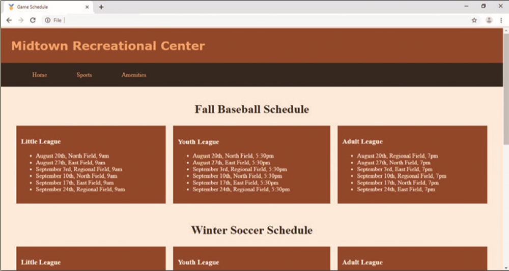

Work with the _index.html_ and the _styles.css_ files from the provided files. The _index.html_ webpage contains generic `div` elements for content and needs to be revised to use HTML 5 semantic elements. You then create new style rules to format the semantic elements. Use _Figure 7-77_ as a guide to correct these files.

Figure 7-77
