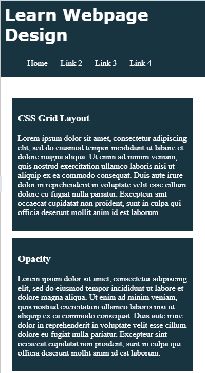
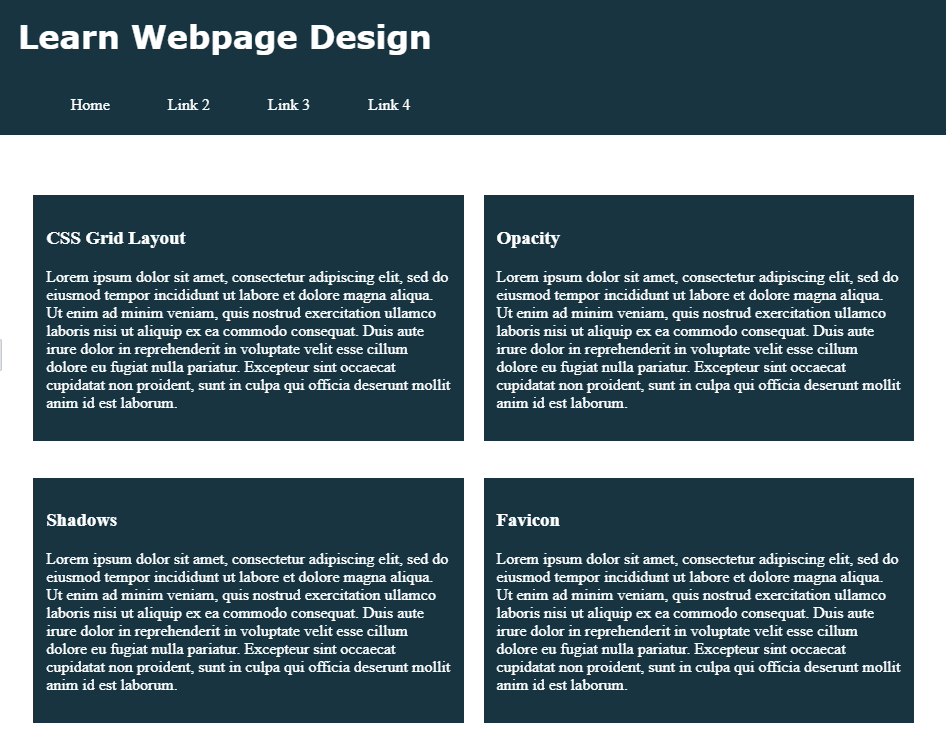
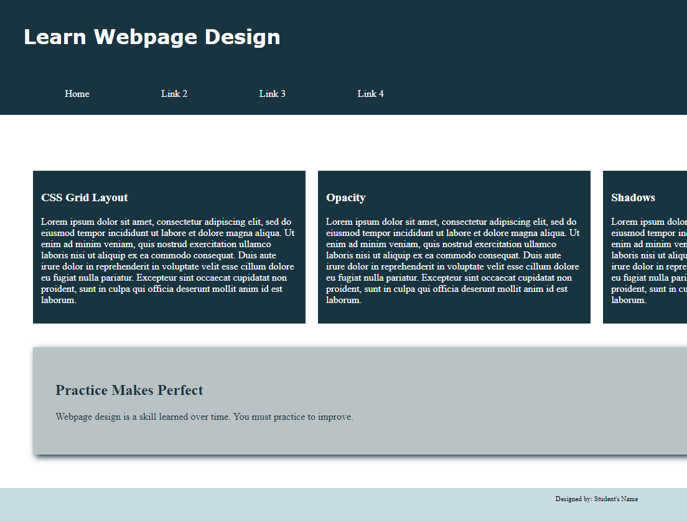

In this exercise, you will style HTML 5 semantic elements. You insert `section`, `article`, and `aside` elements in an HTML document. You then add a style rule to format each element. You will create a two-column layout for a tablet viewport and a three-column layout for a desktop viewport using the CSS grid layout. You will also apply a box shadow to the `aside` element. Finally, you will add a `favicon`. You will also use professional web development practices to indent, space, comment, and validate your code. The completed webpage, as displayed in a mobile viewport, is shown in _Figure 7-73_. The completed webpage, as displayed in a tablet viewport, is shown in _Figure 7-74_. The completed webpage, as displayed in a desktop viewport, is shown in _Figure 7-75_.

Figure 7-73

Figure 7-74

Figure 7-75
