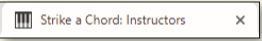

You work for a local music lesson company called Strike a Chord that provides music lessons for piano, guitar, and violin. The company needs a web presence and has hired you to create their website. You have already developed a responsive web design website in the previous chapters and now need to integrate additional HTML5 semantic elements and create a new page. The Instructors page, displayed in mobile, tablet, and desktop viewports, and the favicon is shown in *Figure 7-78a*, *Figure 7-78b*, *Figure 7-78c*, *Figure 7-78d*. 

*Figure 7-78a*

*Figure 7-78b*

*Figure 7-78c*

*Figure 7-78d*

Validate your HTML and CSS files and correct any errors.
Review your files for best coding practices; ensure proper spacing and indents for improved readability.

Open the instructors.html page within a browser, and view the page in all three viewports, as shown in *Figure 7–78*.

- In this assignment, you add HTML 5 semantic elements. Research the `time` semantic element, identify its use, and then discuss its attribute and the different ways in which time can be displayed.

Use the button below to copy the files from the previous chapter

<!--
{
    "CopyExercise": {
        "name": "Chapter 6 EX01",
        "copyTarget": "/chapter6/ex01/student/*",
        "pasteTarget": "./"
    }
}
-->