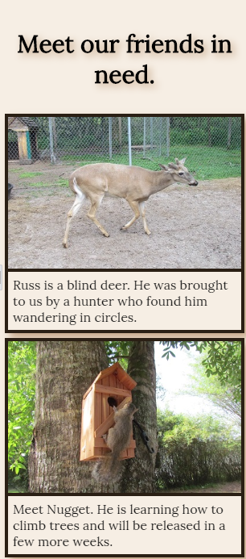
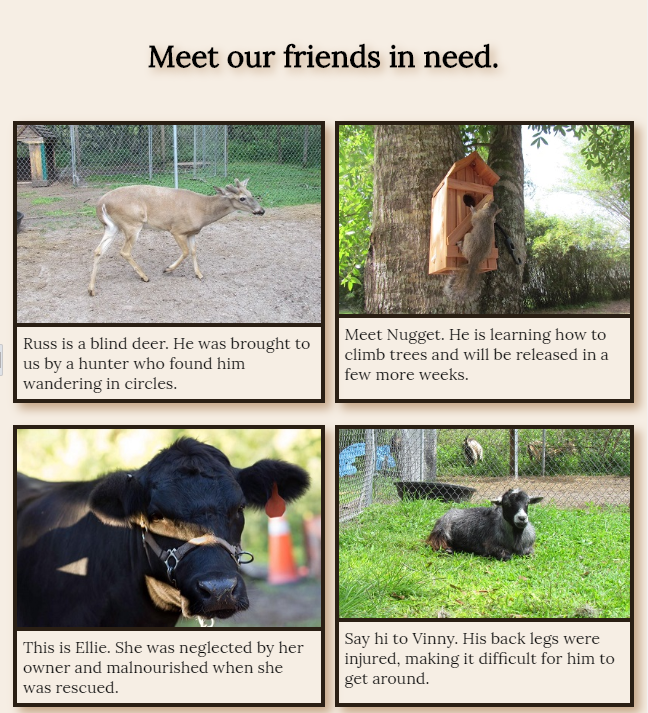
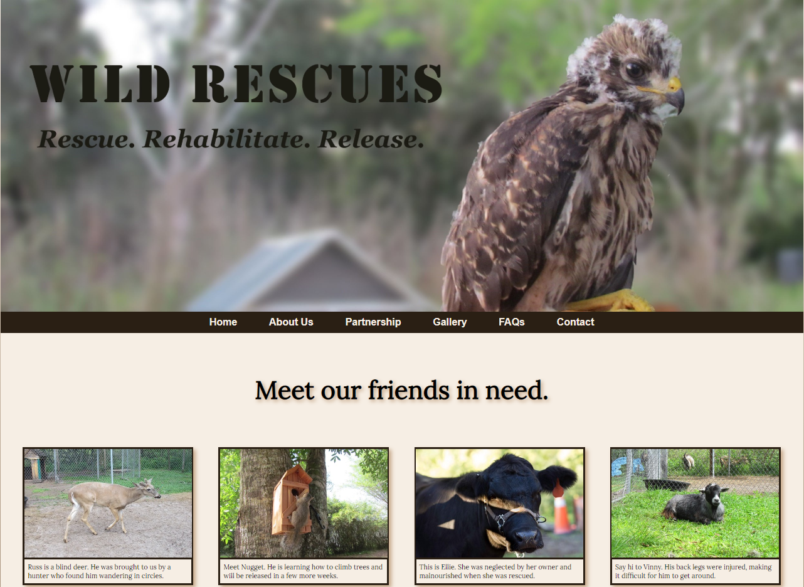
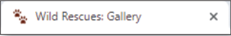

You volunteer at a local wildlife rescue, a nonprofit organization called Wild Rescues. The organization rescues all kinds of wild animals, rehabilitates them, and then releases them back into the wild. Wild Rescues needs a website to help raise awareness about the organization. You have already developed a responsive web design website in previous chapters and now need to integrate additional HTML5 semantic elements and create a new page. The Gallery page, displayed in mobile and tablet viewports, is shown in *Figure 7-79*. The Gallery page, as displayed in desktop and large desktop viewports is shown in *Figure 7-80*. *Figure 7-80* also shows the favicon.

*Figure 7-79a*

*Figure 7-79b*

*Figure 7-80a*

*Figure 7-80b*

*Figure 7-80c*

Validate your HTML and CSS files and correct any errors.

Open the gallery.html page within Google Chrome’s device mode, and view the page in a mobile, tablet, desktop, and large desktop viewports. Exit device mode, view the page in the desktop viewport, and use your mouse to hover over a navigation link to see the opacity effect.

Review your files for best coding practices; ensure proper spacing and indents for improved readability.

- In this assignment, you created style rules for the aside, figure, and figcaption elements. Discuss at least three different declarations you would use to improve the appearance of these elements.

Use the button below to copy the files from the previous chapter

<!--
{
    "CopyExercise": {
        "name": "Chapter 6 EX02",
        "copyTarget": "/chapter6/ex02/student/*",
        "pasteTarget": "./"
    }
}
-->