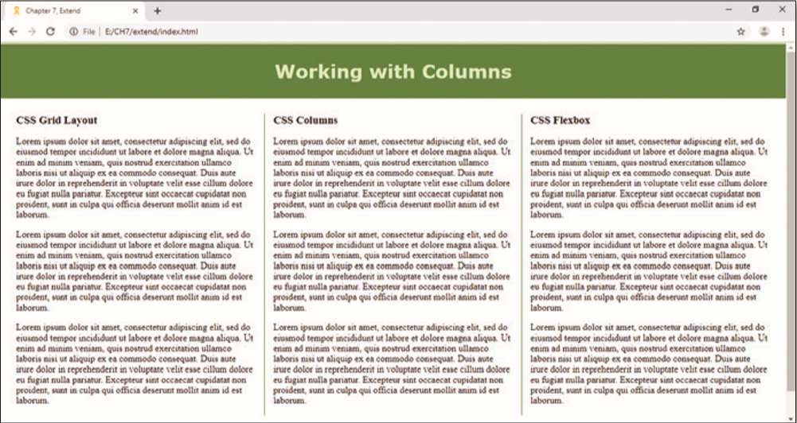

<!--manual-->
In this exercise, you research other ways to create a column layout for a webpage and then use the files provided to create the column layout. You will also use an online favicon generator to create your own favicon. An example of the completed webpage is shown in _Figure 7-76_.

Figure 7-76
