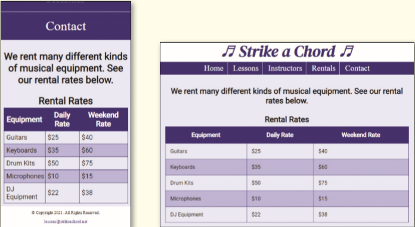
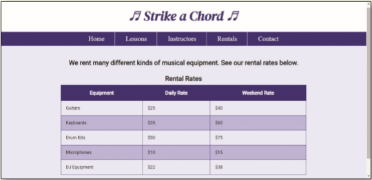
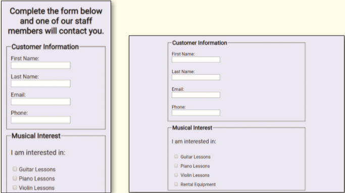
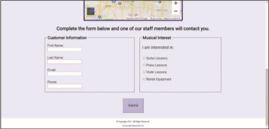

You work for a local music lesson company called Strike a Chord that provides music lessons for piano, guitar, and violin. The company needs a web presence and has hired you to create their website. You have already developed a responsive website and now need to add a table and a form to the website. Use the _template.html_ file to create the Rentals page and add a table to the page. Update the Contact page by adding a `form`. _Figure 8-71_ shows the Rentals page in mobile, tablet, and desktop viewports and _Figure 8-72_ shows the Contact page in mobile, tablet, and desktop viewports.

Figure 8-71a,b

Figure 8-71c

Figure 8-72a,b

Figure 8-72c

Use the button below to copy the files from the previous chapter

<!--
{
    "CopyExercise": {
        "name": "Chapter 7 EX01",
        "copyTarget": "/chapter7/ex01/student/*",
        "pasteTarget": "./"
    }
}
-->