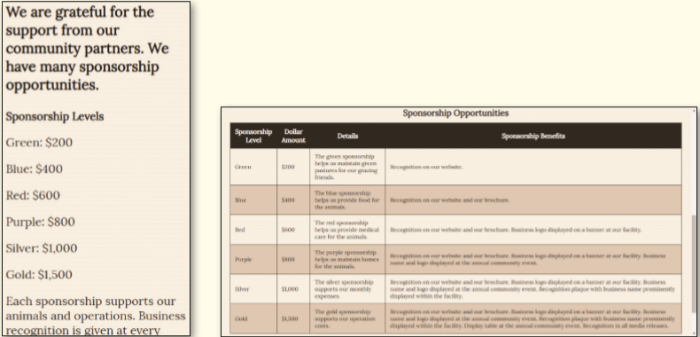
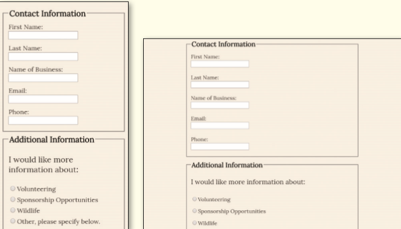
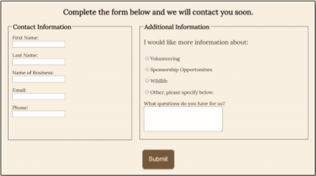

You volunteer at a local wildlife rescue, a nonprofit organization called Wild Rescues. The organization rescues all kinds of wild animals, rehabilitates them, and then releases them back into the wild. Wild Rescues needs a website to help raise awareness about the organization. You have already developed a responsive website in the previous seven chapters and now need to add a table and a form to the website. Use the _template.html_ file to create the Partnership page and add a table to the page. Update the Contact page by adding a form. _Figure 8-73_ shows the Partnership page in in mobile and desktop viewports. _Figure 8-74_ shows the form on the Contact page in mobile, tablet, and desktop viewports.

Figure 8-73a,b

Figure 8-74a,b

Figure 8-74c

Use the button below to copy the files from the previous chapter

<!--
{
    "CopyExercise": {
        "name": "Chapter 7 EX02",
        "copyTarget": "/chapter7/ex02/student/*",
        "pasteTarget": "./"
    }
}
-->