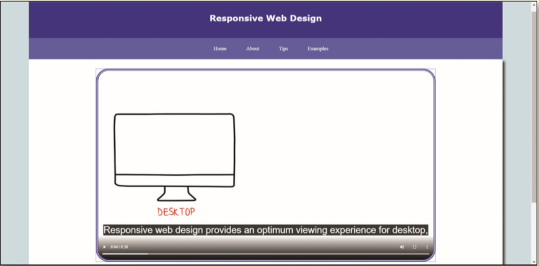

The _index.html_ webpage includes a `video` element; however, no video source is specified. The video also needs captions and descriptions files added for accessibility. _Figure 9-38_ provides an example of the corrected video on a webpage.

Figure 9-38
