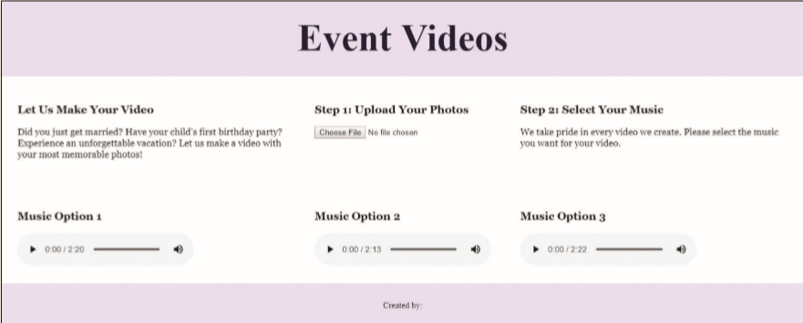

In this exercise, you will add audio to a webpage. Insert three audio elements and include two source elements for each audio file. Work with the *index.html* file and audio files provided in the *media* folder. The completed webpage is shown in *Figure 9-37*. You will also use professional web development practices to indent, space, comment, and validate your code.

*Figure 9-37*

Validate the HTML file and correct any errors.

> Use your browser to research screen readers. What are the most popular screen readers? Is there a screen reader extension available for Google Chrome?