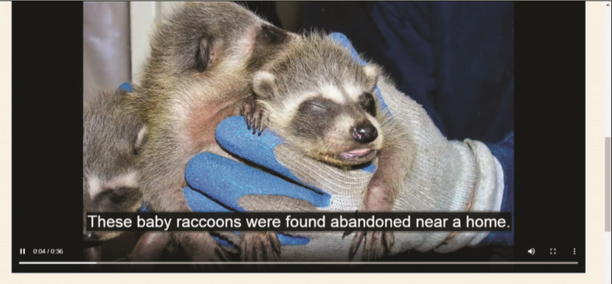

You volunteer at a local wildlife rescue, a nonprofit organization called Wild Rescues. The organization rescues all kinds of wild animals, rehabilitates them, and then releases them back into the wild. Wild Rescues needs a website to help raise awareness about the organization. You have already created the website and now need to add a video with captions. The video, with captions, is shown in _Figure 9-40_.

Figure 9-40

Use the button below to copy the files from the previous chapter

<!--
{
    "CopyExercise": {
        "name": "Chapter 8 EX02",
        "copyTarget": "/chapter8/ex02/student/*",
        "pasteTarget": "./"
    }
}
-->